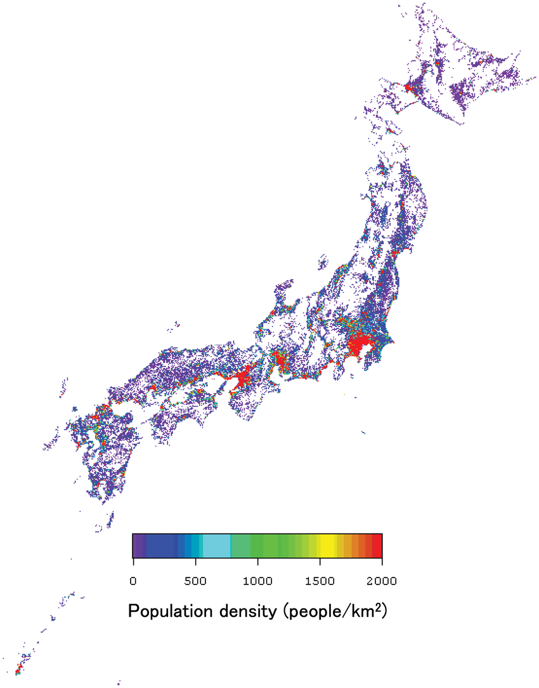

```{r setup, include = FALSE}
knitr::opts_chunk$set(echo = TRUE)
```

```{r, include = FALSE}
source("00_main.R", local = knitr::knit_global())
```


## Summary and context

This markdown document will answer the questions shared by DiDi hiring manager.
All of these are answered using SQL and R script.

A localhost database was created in order to show the query results. Because of 
that a simple run of the script wont publish the result again in another computer.

I'll present each question and follow it by the chunk of SQL needed to answer it.

## Challenge 1

> Write the SQL queries necessary to generate a list of the five restaurants that have the highest average number of visitors on holidays. The result table should also contain that average per restaurant.

```{r con, echo=FALSE}
con <- connect_to_db()
```

```{sql, connection = con}
SELECT id as restaurant_id, avg(visitors) as avg_daily_visitors_on_holiday
FROM 
(SELECT id, visit_date, sum(reserve_visitors) as visitors
FROM restaurant_visitors rv
LEFT JOIN date_info di on rv.visit_date = di.calendar_date
WHERE holiday_flg = 1
GROUP BY id, visit_date) hrv
GROUP BY id
ORDER BY avg_daily_visitors_on_holiday desc
LIMIT 5

```

The top restaurant has an average of 33 daily customers on holidays:

```{r top_five_rest_in_holiday.barplot}
top_five_rest_in_holiday.barplot
```

But in reality, the 4th and 5th could be rearranged, if instead of using the mean
we use the median.

```{r top_five_rest_in_holiday.boxplot}
top_five_rest_in_holiday.boxplot
```

Its important to view the full distribution when a mean vs mean analysis is
requested. 

```{r top_five_rest_in_holiday.densityplot}
top_five_rest_in_holiday.densityplot
```

## Challenge 2

> Use SQL to discover which day of the week there are usually more visitors on average in restaurants.

Answering in total and not by restaurant

```{sql, connection = con}
select
day_of_week,
avg(visitors) as avg_visitors_by_weekday
FROM
(SELECT 
visit_date, 
day_of_week, 
sum(reserve_visitors) as visitors
FROM restaurant_visitors rv
LEFT JOIN date_info di on rv.visit_date = di.calendar_date
GROUP BY visit_date, day_of_week) vrw
GROUP BY day_of_week
ORDER BY avg_visitors_by_weekday DESC

```

Saturday is the weekday with more avg costumers (bar plot). 
But the median (blue points) is almost the same on Friday and Saturday.

```{r weekday_w_more_visitors.barplot}
weekday_w_more_visitors.barplot
```

The distribution of Saturday tends to be higher, just with almost the same median as Friday.
The distribution is skewed to the right, that's whey there's a big difference between median and mean.

```{r weekday_w_more_visitors.boxplot}
weekday_w_more_visitors.boxplot
```

Its important to view the full distribution when a mean vs mean analysis is
requested. 

```{r top_five_rest_in_holiday.densityplot}
top_five_rest_in_holiday.densityplot
```

Answering  by restaurant

```{sql, connection = con}
select
day_of_week,
avg(visitors) as avg_visitors_by_weekday
FROM
(SELECT 
visit_date, 
day_of_week, 
sum(reserve_visitors) as visitors
FROM restaurant_visitors rv
LEFT JOIN date_info di on rv.visit_date = di.calendar_date
GROUP BY visit_date, day_of_week) vrw
GROUP BY day_of_week
ORDER BY avg_visitors_by_weekday DESC

```

Saturday is the weekday with more avg costumers (bar plot). 
But the median (blue points) is almost the same on Friday and Saturday.

```{r weekday_w_more_visitors.barplot}
weekday_w_more_visitors.barplot
```

The distribution of Saturday tends to be higher, just with almost the same median as Friday.
The distribution is skewed to the right, that's whey there's a big difference between median and mean.

```{r weekday_w_more_visitors.boxplot}
weekday_w_more_visitors.boxplot
```

Its important to view the full distribution when a mean vs mean analysis is
requested. 

```{r top_five_rest_in_holiday.densityplot}
top_five_rest_in_holiday.densityplot
```


## Including Plots

You can also embed plots, for example:

```{r pressure, echo=FALSE}
plot(pressure)
```

Note that the `echo = FALSE` parameter was added to the code chunk to prevent printing of the R code that generated the plot.



